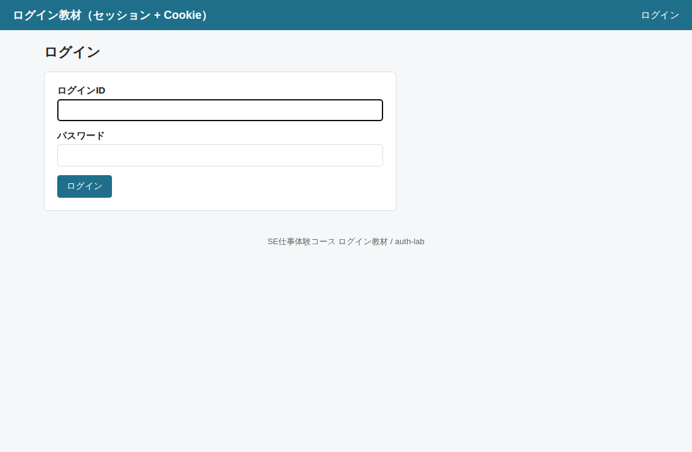

# auth-lab — ログインと認証の学習教材（SE仕事体験コース）

「ログインって中で何が起きているの？」を、動くアプリを触りながら4段階で学ぶ教材です。
最後は [bihin-app（備品貸出管理システム）](https://github.com/DevSOONESSorg/bihin-app) にログインを付けるところまで行きます。



## 4つの段階

| 段 | 立場 | やること | 資料 |
|---|---|---|---|
| 第1段 | 開発者 | セッション + Cookie のログインを動かして、仕組みを確かめる | [docs/01-login.md](docs/01-login.md) |
| 第2段 | 情シス | 入社・異動・退職・パスワード忘れの申請を処理する（アカウント運用） | [docs/02-it-admin.md](docs/02-it-admin.md) |
| 第3段 | 連携担当 | 別サービス「社員マスタAPI」を、認証なし → APIキー → JWT の順につなぐ | [docs/03-api-auth.md](docs/03-api-auth.md) |
| 第4段 | 開発者 | ログインと権限を bihin-app に移植する | [docs/04-merge.md](docs/04-merge.md) |

第1段と第4段はコードを読む・書く段、第2段は画面操作だけの段、第3段は設定と確認が中心の段です。
プログラミングが苦手な人は第2段だけでも「情シスの仕事」を体験できます。

用語がわからないときは [docs/glossary.md](docs/glossary.md) を見てください。

---

## まず使うログイン情報（教材用）

起動したら <http://localhost:4000> を開き、次のいずれかでログインします。**パスワードはすべて `Taiken-2026`** です。

| ログインID | パスワード | 表示名 | 役割 | 状態 |
|---|---|---|---|---|
| `admin` | `Taiken-2026` | 情シス 新垣 | 情シス（管理者） | 通常。まずはこれで入る |
| `higa` | `Taiken-2026` | 比嘉 | 一般社員 | 通常 |
| `kinjo` | `Taiken-2026` | 金城 | 一般社員 | 初期パスワード状態（ログインすると変更を求められる） |

これは教材用のダミーです。実際のシステムでこのような共通パスワードを使ってはいけません。
「パスワードを保存しますか？」と Chrome に聞かれたら「使用しない」で構いません。

> 補足：`password` のような有名な文字列にすると、Chrome が「このパスワードは漏えいしています」と警告を出して学習の妨げになるため、教材固有の文字列にしています。

---

## 何が入っているか

このリポジトリには **2つのサービス** が入っていて、`docker compose up` で両方が起動します。

```
auth-lab/
├── web/    ログイン教材アプリ（画面あり）           http://localhost:4000
└── api/    社員マスタAPI（JSONを返すだけ、画面なし）  http://localhost:4001
```

### web（ログイン教材アプリ）

- ログイン / ログアウト / パスワード変更
- パスワードは bcrypt でハッシュして保存（元の文字列は保存しない）
- ログイン失敗5回でロック（10分）、無効化されたアカウントは拒否
- 初期パスワードのユーザーは、初回ログイン時にパスワード変更を強制
- 役割（情シス / 一般社員）による画面の出し分けと、権限チェック
- ユーザー管理（発行・編集・無効化・有効化・パスワードリセット）
- 監査ログ（誰が・いつ・何をしたか）
- 社員一覧：api を呼んで表示する（第3段）

### api（社員マスタAPI）

- `GET /employees`、`GET /employees/:no` で社員データ（架空）を返す
- 認証方式を環境変数で切り替えられる：`none`（認証なし）/ `apikey` / `jwt`
- `POST /token` で client_id / client_secret と引き換えにアクセストークン（JWT）を発行

---

## 動かし方

### 必要なもの

- Docker Desktop が起動していること
- このリポジトリ（Code → Download ZIP、または `git clone`）

### 手順

```bash
cd auth-lab
cp .env.example .env      # Windows は copy .env.example .env
docker compose up --build
```

次の2行が出たら起動完了です。

```
ログイン教材（セッション + Cookie） を起動しました → http://localhost:4000
社員マスタAPI を起動しました（認証方式: none） → http://localhost:4001
```

ブラウザで <http://localhost:4000> を開き、`admin` / `Taiken-2026` でログインしてください。

### 止め方

`Ctrl + C` のあと `docker compose down`

### .env を変えたとき

`.env` の値（認証方式や鍵）を変えたら、`Ctrl + C` で止めてから `docker compose up` をやり直してください。コード（`src/` の中）を直したときは自動で再起動されます。

### データを初期状態に戻す

```bash
docker compose run --rm web npm run reset
```

`web/data/auth.db` を手で削除しても同じです。次回起動時に初期ユーザーが入り直します。

### bihin-app と同時に動かす

bihin-app は 3000 番、auth-lab は 4000 / 4001 番を使うので、そのまま同時に動かせます。

---

## フォルダ構成

```
auth-lab/
├── README.md
├── docker-compose.yml        ← web と api の2つを起動する
├── .env.example              ← 設定のひな形（認証方式・鍵・ポート）
├── docs/                     ← 各段の手順書と用語集
│
├── web/
│   ├── Dockerfile
│   ├── package.json
│   ├── src/
│   │   ├── server.js         ← 起動の入口。セッションの設定はここ
│   │   ├── config.js         ← ロック回数、セッション時間などの設定
│   │   ├── db.js             ← users / audit_logs テーブルの定義
│   │   ├── auth/             ← ★ログインの本体（この3ファイルを bihin-app に持っていく）
│   │   │   ├── users.js      ←   ユーザーの読み書き、パスワードのハッシュ、監査ログ
│   │   │   ├── routes.js     ←   /login /logout /password
│   │   │   └── middleware.js ←   requireLogin / requireRole
│   │   ├── routes/
│   │   │   ├── admin-users.js ← ユーザー管理（情シス用）
│   │   │   └── employees.js   ← 社員一覧（api を呼ぶ）
│   │   ├── lib/
│   │   │   └── employeeApi.js ← api を呼ぶ側のコード（none / apikey / jwt に対応）
│   │   └── views/            ← 画面（EJS）
│   ├── public/style.css
│   └── data/                 ← auth.db が作られる
│
└── api/
    ├── Dockerfile
    ├── package.json
    └── src/
        ├── server.js         ← 起動の入口
        ├── config.js         ← 認証方式と鍵（環境変数から読む）
        ├── auth.js           ← ★呼び出し元を確認する処理（none / apikey / jwt）
        ├── employees.js      ← 社員データ（配列）
        └── routes/
            ├── token.js      ← POST /token（JWT発行）
            └── employees.js  ← GET /employees
```

---

## ログインの仕組み（30秒版）

1. ログイン画面でIDとパスワードを送る
2. サーバーは、保存してある **ハッシュ** と照合する（パスワードそのものは保存していない）
3. 合っていれば、サーバーのメモリに「セッション」を作り、ランダムな **セッションID** を発行する
4. ブラウザには、そのセッションIDだけを **Cookie**（名前 `sid`）で渡す
5. 以後のリクエストにはブラウザが自動で Cookie を付けるので、サーバーは「このセッションIDの人は admin だな」と分かる
6. ログアウトはサーバー側のセッションを消すこと。Cookie だけ消しても同じ効果

セッションはサーバーのメモリにあるので、**サーバーを再起動すると全員ログアウト** になります。本番ではセッションをDBやRedisに保存してこれを防ぎます（教材ではあえてそのままにしてあります。体験して確かめてください）。

---

## 使っている技術

| 役割 | 技術 |
|---|---|
| セッション管理 | express-session（Cookie 名 `sid`、httpOnly、SameSite=Lax） |
| パスワードのハッシュ | bcryptjs |
| JWT の発行と検証 | jsonwebtoken |
| データベース | SQLite（better-sqlite3） |
| 画面 | Express + EJS |
| 実行環境 | Docker Compose（2サービス） |

実務では、認証を自作せず Auth0・Firebase Authentication・Amazon Cognito・Keycloak などの認証サービスを使うことも多いです。この教材は「中で何が起きているか」を知るために自作しています。

---

## ライセンス

MIT License

## 作成

株式会社SOONESS（就労継続支援A型）SE仕事体験コース
